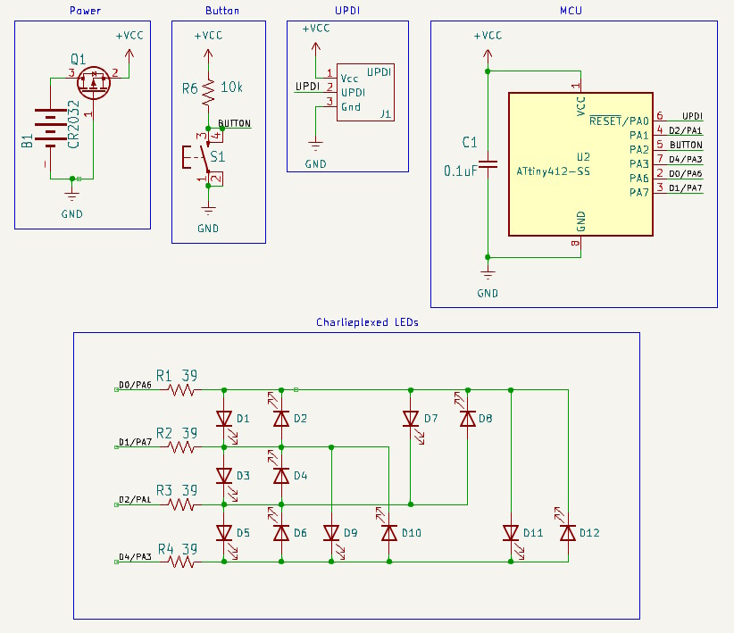
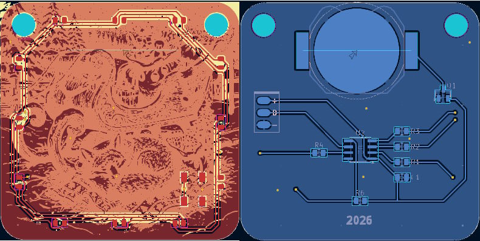
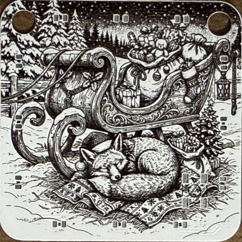

Christmas ornament number 14...

***

The detailed explanation of the original Snowman ornament is [here](https://github.com/timtilities/ChristmasOrnaments--2013-Snowman).

This ornament has been redesigned around the newer Attiny412. The schematic and PCB have been updated to use UPDI programming and the new pinout of the Attiny412. Since these use UPDI, you will need a programmer. I am currently using a [converted Arduino Nano](https://daumemo.com/diy-updi-usb-programmer-which-can-be-made-with-cheap-hardware/) as a [jtag2updi](https://github.com/ElTangas/jtag2updi) programmer. 

### Compiling with Arduino IDE

* Install [megaTinyCore](https://github.com/SpenceKonde/megaTinyCore) using the boards manager
* Select **Attiny412/402/212/202** from the boards list
* Set the *Clock source* to **4MHz (internal)**
* Set *B.O.D Mode* to **Disabled**
* Set *B.O.D. voltage level* to **1.8v**
* Select the **Attiny412** chip
* Select **Burn Bootloader** to write the fuses
* Compile and upload the program to the MCU
